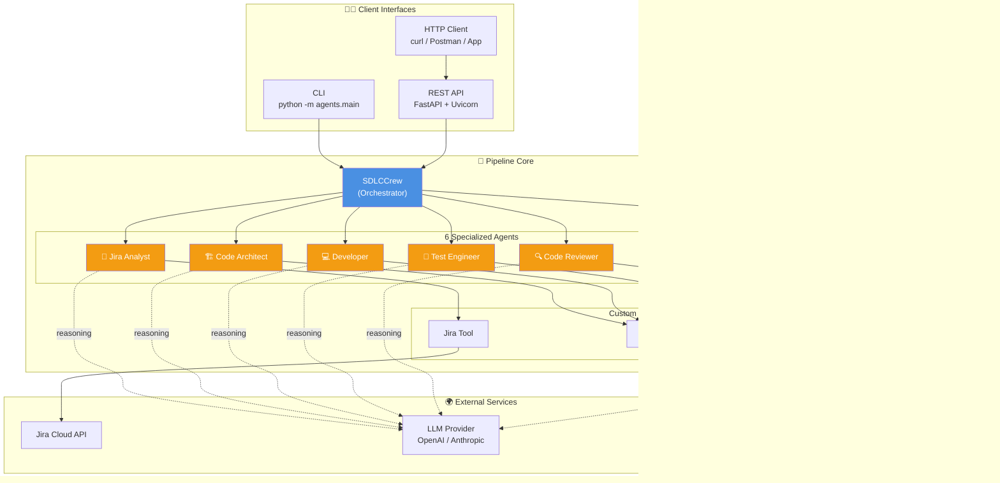
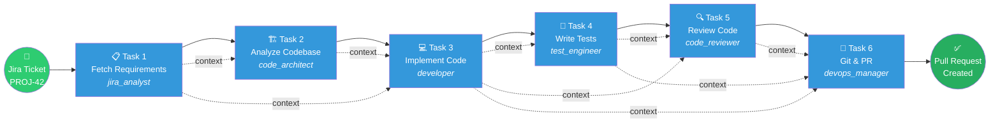
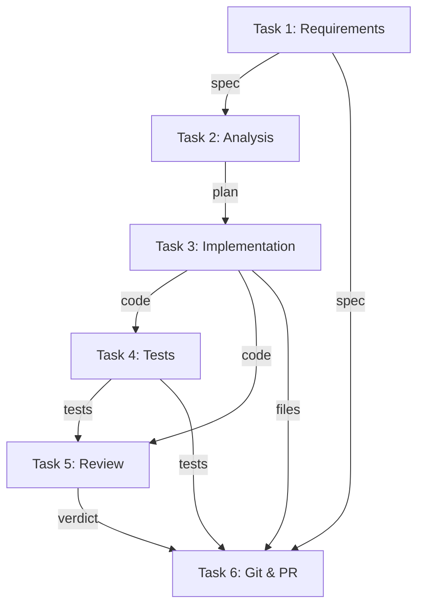

# 🤖 Multi-Agent SDLC Pipeline

An autonomous AI-powered Software Development Life Cycle pipeline built with **CrewAI**. Six specialized AI agents collaborate to take a Jira ticket from requirements analysis all the way to an open Pull Request on GitHub — no human intervention required in between.

Use it via **CLI** for local runs or **REST API** for integrations.

---

## ✨ Features

- 🎫 **Fetches Jira tickets** and auto-generates technical specs
- 🏗️ **Analyzes your codebase** and produces implementation plans
- 💻 **Writes production code** with type hints, docstrings, and error handling
- 🧪 **Generates pytest tests** with comprehensive coverage
- 🔍 **Reviews its own code** for security, performance, and quality
- 🚀 **Automates git workflow** — branch, commit, push, and open PR
- 🌐 **Dual interface** — CLI for developers, REST API for integrations
- 🛡️ **Sandboxed file operations** — path traversal protection
- 🔁 **Idempotent** — safe to re-run on the same ticket

---

## 🏛️ Architecture

### High-Level System Architecture



### Sequential Task Flow (SDLC Pipeline)



## 📁 Project Structure

```
sdlc-pipeline/
├── agents/                       # Core CrewAI pipeline
│   ├── __init__.py
│   ├── crew.py                   # Orchestrates agents & tasks
│   ├── main.py                   # CLI entry point
│   ├── config/
│   │   ├── agents.yaml           # Agent role/goal/backstory
│   │   └── tasks.yaml            # Task definitions & context wiring
│   └── tools/
│       ├── __init__.py
│       └── custom_tools.py       # Jira, Codebase, Git/GitHub tools
├── api/                          # REST API layer
│   ├── __init__.py
│   ├── server.py                 # FastAPI app + endpoints
│   ├── models.py                 # Request/response schemas
│   └── job_store.py              # In-memory job tracker
├── .env                          # 🔒 Your secrets (git-ignored)
├── .env.example                  # ✅ Template for team
├── .gitignore
├── requirements.txt
└── README.md
```

---

## 🔧 Prerequisites

- **Python** 3.10 or higher
- **Git** installed and configured
- **A target project** — a local git repository (with GitHub remote) that the pipeline will modify
- **API credentials:**
  - Jira Cloud API token
  - GitHub Personal Access Token (or GitHub App)
  - OpenAI or Anthropic API key

---

## 🚀 Setup

### 1. Clone or create the project

```bash
git clone <this-repo> sdlc-pipeline
cd sdlc-pipeline
```

### 2. Create a virtual environment

```bash
python -m venv .venv

# macOS/Linux
source .venv/bin/activate

# Windows
.venv\Scripts\activate
```

### 3. Install dependencies

```bash
pip install --upgrade pip
pip install -r requirements.txt
```

### 4. Get your credentials

| Service | Where to get it |
|---------|-----------------|
| **Jira API Token** | https://id.atlassian.com/manage-profile/security/api-tokens |
| **GitHub PAT** | https://github.com/settings/tokens (needs `repo` scope) |
| **OpenAI Key** | https://platform.openai.com/api-keys |
| **Anthropic Key** | https://console.anthropic.com/settings/keys |

### 5. Configure environment variables

Copy the template and fill in your values:

```bash
cp .env.example .env
```

Edit `.env`:

```bash
# Jira
JIRA_URL=https://yourcompany.atlassian.net
[email protected]
JIRA_API_TOKEN=ATATT3xFfGF0...

# GitHub
GITHUB_TOKEN=ghp_yourTokenHere
GITHUB_REPOSITORY=your-org/your-repo   # optional (auto-detected)

# Target codebase (absolute path)
WORKSPACE_PATH=/Users/john/projects/my-app

# LLM Provider
OPENAI_API_KEY=sk-proj-...
OPENAI_MODEL_NAME=gpt-4o-mini
```

### 6. Prepare your target project

The pipeline modifies a **local codebase**. Make sure it:

```bash
cd /path/to/your/project

# Is a git repo
git status  # If not: git init

# Has a GitHub remote
git remote -v  # If not: git remote add origin <url>

# Has a 'main' branch pushed
git push -u origin main
```

---

## 🎯 Usage

You have **two ways** to run the pipeline.

### Option 1: CLI (One-off runs)

```bash
# Basic usage
python -m agents.main PROJ-42

# With explicit workspace override
python -m agents.main --ticket PROJ-42 --workspace /path/to/project
```

**Example output:**

```
╭─────────── 🤖 Multi-Agent SDLC ───────────╮
│ Starting SDLC pipeline                     │
│ Ticket:    PROJ-42                         │
│ Workspace: /Users/john/projects/my-app     │
│ Model:     gpt-4o-mini                     │
╰────────────────────────────────────────────╯

[Agent: jira_analyst] Fetching PROJ-42...
[Agent: code_architect] Analyzing codebase...
[Agent: developer] Writing src/greeter.py...
[Agent: test_engineer] Writing tests/test_greeter.py...
[Agent: code_reviewer] Reviewing... FINAL VERDICT: APPROVED
[Agent: devops_manager] Creating PR...

╭──────────────── ✅ Done ────────────────╮
│ Pipeline completed successfully!         │
│ PR: https://github.com/john/repo/pull/47 │
╰──────────────────────────────────────────╯
```

### Option 2: REST API (For integrations)

#### Start the server

```bash
uvicorn api.server:app --host 0.0.0.0 --port 8000 --reload
```

Server starts on `http://localhost:8000`. Interactive docs at `http://localhost:8000/docs`.

#### API Endpoints

| Method | Endpoint | Description |
|--------|----------|-------------|
| `GET` | `/health` | Health check + env validation |
| `POST` | `/pipeline/run` | Trigger a pipeline (async) |
| `GET` | `/pipeline/status/{job_id}` | Poll job status |
| `GET` | `/pipeline/jobs` | List all jobs |

---

## 📡 API Usage Examples

### Example 1: Trigger with curl

```bash
curl -X POST http://localhost:8000/pipeline/run \
  -H "Content-Type: application/json" \
  -d '{"jira_ticket_id": "PROJ-42"}'
```

**Response (immediate):**
```json
{
  "job_id": "a1b2c3d4-e5f6-7890-abcd-ef1234567890",
  "status": "queued",
  "jira_ticket_id": "PROJ-42",
  "message": "Pipeline queued. Poll /pipeline/status/{job_id} for progress."
}
```

### Example 2: Poll for status

```bash
curl http://localhost:8000/pipeline/status/a1b2c3d4-e5f6-7890-abcd-ef1234567890
```

**While running:**
```json
{
  "job_id": "a1b2c3d4-...",
  "status": "running",
  "jira_ticket_id": "PROJ-42",
  "started_at": "2025-01-15T10:32:15",
  "completed_at": null,
  "duration_seconds": null,
  "result": null,
  "error": null
}
```

**On success:**
```json
{
  "job_id": "a1b2c3d4-...",
  "status": "success",
  "jira_ticket_id": "PROJ-42",
  "started_at": "2025-01-15T10:32:15",
  "completed_at": "2025-01-15T10:38:42",
  "duration_seconds": 387.86,
  "result": "PR created -> https://github.com/john/repo/pull/47",
  "error": null
}
```

### Example 3: Custom workspace path

```bash
curl -X POST http://localhost:8000/pipeline/run \
  -H "Content-Type: application/json" \
  -d '{
    "jira_ticket_id": "PROJ-42",
    "workspace_path": "/Users/john/projects/other-repo"
  }'
```

### Example 4: Python client

```python
import time
import requests

BASE_URL = "http://localhost:8000"

# Trigger
resp = requests.post(
    f"{BASE_URL}/pipeline/run",
    json={"jira_ticket_id": "PROJ-42"},
)
job_id = resp.json()["job_id"]
print(f"🚀 Started job: {job_id}")

# Poll
while True:
    status = requests.get(f"{BASE_URL}/pipeline/status/{job_id}").json()
    print(f"⏳ Status: {status['status']}")
    
    if status["status"] == "success":
        print(f"✅ Done! {status['result']}")
        break
    elif status["status"] == "failed":
        print(f"❌ Failed: {status['error']}")
        break
    
    time.sleep(10)
```

### Example 5: JavaScript / Node.js client

```javascript
const BASE_URL = "http://localhost:8000";

async function runPipeline(ticketId) {
  // Trigger
  const res = await fetch(`${BASE_URL}/pipeline/run`, {
    method: "POST",
    headers: { "Content-Type": "application/json" },
    body: JSON.stringify({ jira_ticket_id: ticketId }),
  });
  const { job_id } = await res.json();
  console.log(`🚀 Job: ${job_id}`);

  // Poll
  while (true) {
    const status = await (
      await fetch(`${BASE_URL}/pipeline/status/${job_id}`)
    ).json();
    console.log(`⏳ ${status.status}`);
    
    if (status.status === "success") {
      console.log(`✅ ${status.result}`);
      return status;
    }
    if (status.status === "failed") {
      throw new Error(status.error);
    }
    await new Promise((r) => setTimeout(r, 10000));
  }
}

runPipeline("PROJ-42");
```

### Example 6: List all jobs

```bash
curl http://localhost:8000/pipeline/jobs
```

### Example 7: Health check

```bash
curl http://localhost:8000/health
```

**Response:**
```json
{
  "status": "ok",
  "version": "1.0.0"
}
```

---

## 🧠 How It Works

### The 6 Agents

| Agent | Tools | Responsibility |
|-------|-------|----------------|
| 🎫 **jira_analyst** | `fetch_jira_ticket` | Turns Jira ticket into a technical spec |
| 🏗️ **code_architect** | `list_files`, `read_file` | Scans codebase, plans changes |
| 💻 **developer** | `read_file`, `write_file` | Writes production code |
| 🧪 **test_engineer** | `read_file`, `write_file` | Writes pytest test suite |
| 🔍 **code_reviewer** | `read_file` | Reviews everything for quality |
| 🚀 **devops_manager** | Git + GitHub tools | Branches, commits, pushes, PRs |

### The 7 Custom Tools

| Tool | Purpose | Side Effect |
|------|---------|-------------|
| `fetch_jira_ticket` | Get ticket details from Jira | None (read-only) |
| `list_workspace_files` | Recursively list files | None |
| `read_file` | Read file contents | None |
| `write_file` | Create/overwrite a file | ✏️ Writes to disk |
| `git_create_branch` | Create/checkout branch | 🌿 Modifies git state |
| `git_commit_and_push` | Stage, commit, push | 📤 Pushes to remote |
| `github_open_pull_request` | Open PR on GitHub | 🔀 Creates PR |

### Sequential Task Execution

Tasks run **one after another** with automatic context passing:



---

## 🐛 Troubleshooting

| Symptom | Fix |
|---------|-----|
| `ModuleNotFoundError: agents` | Run from project root, not inside `agents/` |
| `Missing required environment variables` | Check `.env` is in project root |
| `ERROR: Not a git repository` | Run `git init` in `WORKSPACE_PATH` |
| `ERROR: Remote 'origin' not configured` | `git remote add origin <url>` |
| `Jira request failed: 401` | Regenerate Jira API token |
| `GitHub API error: 404` | Check `GITHUB_REPOSITORY` format is `owner/repo` |
| Agent generates code but doesn't write files | Upgrade to `OPENAI_MODEL_NAME=gpt-4o` |
| API doesn't reload on code change | Ensure `--reload` flag is passed to uvicorn |
| Pipeline hangs > 15 min | Try a simpler ticket first; check LLM API status |
| `RateLimitError` | Add billing to OpenAI account or wait |

---

## 🧪 Testing the Setup

### 1. Verify environment

```bash
python -c "from dotenv import load_dotenv; load_dotenv(); import os; print('✅' if all(os.getenv(v) for v in ['JIRA_URL', 'JIRA_API_TOKEN', 'GITHUB_TOKEN']) else '❌')"
```

### 2. Test Jira connectivity

```bash
python -c "
from agents.tools.custom_tools import JiraFetchTool
from dotenv import load_dotenv
load_dotenv()
print(JiraFetchTool()._run(ticket_id='YOUR-TICKET-ID'))
"
```

### 3. Test API health

```bash
uvicorn api.server:app --port 8000 &
sleep 3
curl http://localhost:8000/health
```

### 4. Run a smoke test

```bash
# Simple ticket that should work
python -m agents.main YOUR-SIMPLE-TICKET-ID
```

---

## 📊 Monitoring the Pipeline

While the pipeline runs, watch verbose output:

- **CLI:** All agent reasoning + tool calls printed to stdout
- **API:** Check server logs and use `GET /pipeline/status/{job_id}`
- **Interactive:** Open http://localhost:8000/docs for Swagger UI

---

## 🚦 Roadmap / Not Yet Implemented

This is a **local/dev-grade** implementation. Missing for production:

- ❌ Authentication on API endpoints (add API key middleware)
- ❌ Persistent job storage (currently in-memory)
- ❌ Horizontal scaling (currently single-server)
- ❌ Rate limiting
- ❌ Distributed tracing / observability
- ❌ Cost tracking per run
- ❌ Prompt injection filtering
- ❌ Multi-tenant isolation

See the [Production Deployment Guide](#) for hardening steps.

---

**Happy shipping! 🚀 Let AI handle the boilerplate so you can focus on the interesting problems.**